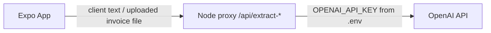

# NextInvoice

A React Native (Expo) invoicing app: create invoices manually or by pasting client details for AI to auto-fill, export them as PDF, and share directly from your phone. UI is available in Albanian (default) and English. Company details are extracted once from a sample invoice you upload, then kept in the Profile tab.

## Repo layout

- [app/](app) - the Expo React Native app (three tabs: Invoices, New Invoice, Profile)
- [server/](server) - a tiny Node/Express proxy that holds the OpenAI API key and exposes two AI endpoints. **The key never ships inside the mobile app.**



## 1. Run the server

```bash
cd server
npm install
cp .env.example .env   # then edit .env and set OPENAI_API_KEY
npm start
```

The server listens on `http://localhost:4000` by default (`/health`, `/api/extract-client`, `/api/extract-company`).

`OPENAI_MODEL` defaults to `gpt-5-mini` in `.env.example` - change it if that model isn't available to your key.

Your API key stays only in `server/.env`, which is git-ignored. Never put it inside the `app/` folder or commit it.

### Deploying the server

For real device testing (not just your dev machine's Wi-Fi), deploy `server/` to any Node host - Render, Railway, Fly.io, etc. all have free tiers. Set the same env vars there, then point the app at the deployed URL (see step 3).

## 2. Run the app

```bash
cd app
npm install
npx expo start
```

Scan the QR code with the Expo Go app (Android/iOS) or run `npm run android` / `npm run ios` from the `app/` folder.

## 3. Point the app at your server

Open the **Profile** tab in the app and set "API Base URL":
- Android emulator: `http://10.0.2.2:4000`
- Physical phone on the same Wi-Fi as your dev machine: `http://<your-computer-LAN-IP>:4000`
- Deployed server: whatever public URL you deployed to

## Using the app

- **Invoices tab**: list of saved invoices; tap one to view details, re-share the PDF, or delete it.
- **New Invoice tab (+)**: choose **Manual** to type the client's Full Name / Address / Phone yourself, or **AI** to paste any blob of client info into one box and tap "Detect details with AI" - it fills those same fields for you to review before saving. Add line items, a discount and notes, then save; the invoice is stored and a PDF is generated and opened in your phone's native share sheet.
- **Profile tab**: edit your company details (pre-filled from your sample invoice), switch language (Shqip/English), or tap "Upload sample invoice" to re-extract company details from a new PDF/photo via AI.

## Notes on the AI integration

- `POST /api/extract-client` takes free-form text and returns `{ fullName, address, phone }`.
- `POST /api/extract-company` takes an uploaded PDF or image and returns the seller/company fields, using OpenAI's file-input support (PDFs are sent directly, no manual conversion needed).
- Both use OpenAI's Structured Outputs (JSON schema) so the response is always well-formed.

## Security

- The OpenAI key lives only in `server/.env`, never inside the app bundle - this is why a small proxy server exists instead of calling OpenAI directly from the phone.
- Don't commit `server/.env`. Rotate the key if it's ever exposed.
