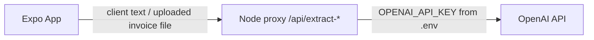

# Faturimi

A React Native (Expo) invoicing app (**display name: Faturimi**): create invoices manually or by pasting client details for AI to auto-fill, export them as PDF, and share directly from your phone. UI is available in Albanian (default) and English. Company details can be loaded from sample data or extracted from a PDF/photo via AI.

**iOS bundle identifier (unchanged):** `com.lirim123.nextinvoice`

## Repo layout

- [app/](app) - the Expo React Native app (three tabs: Invoices, New Invoice, Profile)
- [server/](server) - a tiny Node/Express proxy that holds the OpenAI API key and exposes AI endpoints. **The key never ships inside the mobile app.**
- [docs/](docs) - Privacy Policy, Terms of Use, sample invoice markup
- [APP_REVIEW.md](APP_REVIEW.md) - App Store Review notes and demo script



## 1. Run the server

```bash
cd server
npm install
cp .env.example .env   # then edit .env and set OPENAI_API_KEY
npm start
```

The server listens on `http://localhost:4000` by default (`/health`, `/api/extract-client`, `/api/extract-company`).

Your API key stays only in `server/.env`, which is git-ignored. Never put it inside the `app/` folder or commit it.

### Deploying the server

For real device testing, deploy `server/` to any Node host, then set the public URL in the app Profile tab.

## 2. Run the app

```bash
cd app
npm install
npx expo start
```

## 3. Point the app at your server (optional AI)

Open the **Profile** tab and set "API Base URL" to your deployed server. Core invoice/PDF flows work without AI.

## App Store Review

See [APP_REVIEW.md](APP_REVIEW.md) for reviewer instructions, permissions, and the physical-device demo script.
